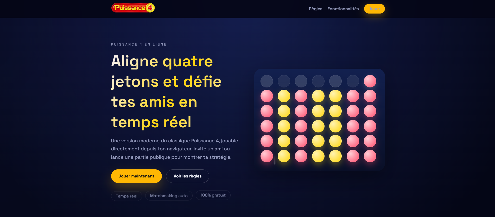

# Puissance 4 Web 

Le but du project était de rendre une version moderne et interactive du célèbre jeu du **Puissance 4**, développée en **Go (Golang)** avec une interface web dynamique.
 

 

## Fonctionnalités

* **Jeu a 2 joueurs** : Jouez en local sur le même écran
* **Animation Fluides** :
    * Chute animés .
    * Illuminations des jetons gagnants.
    * Message d'erreur colonne pleine.
* **Historique des scores**: Sauvegarde automatique des score avec fichier JSON 
* **Personnalisation** : Choix des noms des joueurs et attribution automatique des couleurs.
* **Logique Serveur** : Tout le jeu et coder en backend sur go.

## Technologies 

* **Backend en Golang**
    * `net/http` pour le serveur web.

* **Frontend** :
    * HTML5 / CSS3 
    * JavaScript 

* **Données** : JSON 

## Installation et Lancement

1.  **Prérequis** : Avoir [Go installé] sur sa machine .

2.  **Cloner le projet** :
    ```bash
    git clone [https://github.com/ton-pseudo/power-4-web.git](https://github.com/ton-pseudo/power-4-web.git)
    cd power-4-web
    ```
3.  **Lancer le serveur** :
    ```bash
    go run .
    ```

4.  **Accéder au jeu** :
    Ouvrez allez sur :
    **http://localhost:8000**


## 📂 Structure du Projet

```text
power-4-web/
├── assets/             # Fichiers statiques
│   ├── css/            # Style css
│   ├── js/             # Scripts d'animation (game.js)
│   └── img/            # Favicon et images
├── handlers/           # Gestionnaires des requêtes HTTP
├── models/             # Logique du jeu
├── templates/          # Fichiers HTML 
├── scoreboard.json     # Base de données du score
├── main.go             # Point d'entrée du serveur
└── go.mod              # Gestion des dépendances
```

## Auteur

Project réalisé par BELMONDO Clément, BERARD Samuel